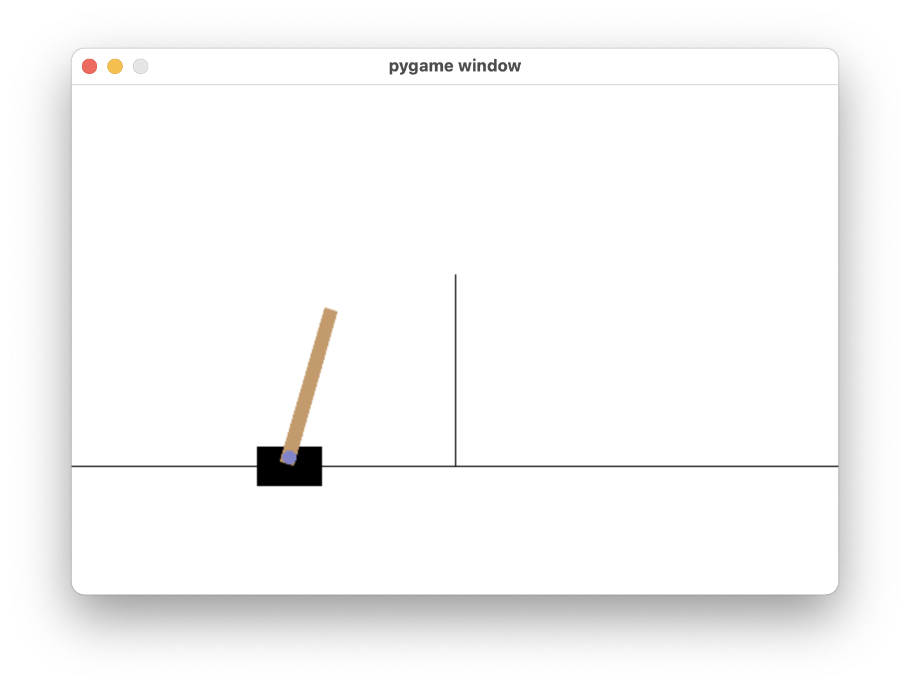
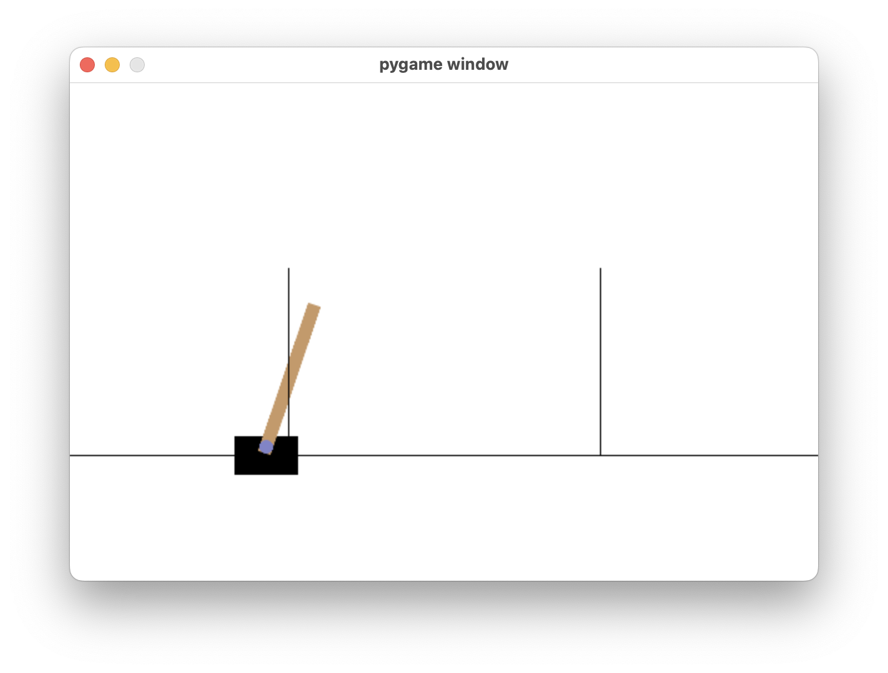

# gym-CartPole-bt

A modified version of the [cart-pole Gymnasium environment](https://gymnasium.farama.org/environments/classic_control/cart_pole/) for testing different controllers and reinforcement learning algorithms.

This is the updated version of [gym-CartPole-bt-v0](https://github.com/billtubbs/gym-CartPole-bt-v0), rewritten for the modern [Gymnasium API](https://gymnasium.farama.org).

It is based on a MATLAB implementation by [Steven L. Brunton](https://www.me.washington.edu/facultyfinder/steve-brunton) as part of his [Control Bootcamp](https://youtu.be/qjhAAQexzLg) series of videos on YouTube.

Features of this set of environments include:
- More challenging control objectives such as stabilizing the cart x-position as well as the pendulum angle, and moving the cart-pendulum horizontally from one point to another
- Continuous (real-valued) control actions
- Random initial states
- Random disturbances
- Partially-observable states
- Random measurement noise on observations
- No episode termination when cart or pendulum move too far from the target



## Installation

Clone or download this repository, then install with pip:

```
pip install -e .
```

To also install development dependencies (ruff, pytest):

```
pip install -e ".[dev]"
```

## Basic Usage

```python
import gymnasium as gym
import gym_CartPole_BT

env = gym.make('CartPole-BT-v1')
observation, info = env.reset()
for _ in range(100):
    action = env.action_space.sample()
    observation, reward, terminated, truncated, info = env.step(action)
    if terminated or truncated:
        observation, info = env.reset()
env.close()
```

## Environments

There are 21 variations of the basic environment. Select an id from the tables below and pass it to `gym.make()`.

### Basic cart-pendulum system

The goal, starting in or near the vertical-up position, is to maintain the cart x-position and pole angle as close as possible to `(0, π)`.

| #  | Id                         | Description                                                              |
| -- | -------------------------- | ------------------------------------------------------------------------ |
|  1 | `'CartPole-BT-v1'`         | Basic cart-pendulum system starting in vertical up position              |
|  2 | `'CartPole-BT-dL-v1'`      | ...with low random disturbance                                           |
|  3 | `'CartPole-BT-dH-v1'`      | ...with high random disturbance                                          |
|  4 | `'CartPole-BT-vL-v1'`      | ...with low variance in initial state                                    |
|  5 | `'CartPole-BT-vH-v1'`      | ...with high variance in initial state                                   |
|  6 | `'CartPole-BT-dL-vL-v1'`   | ...with low random disturbance and low variance in initial state         |
|  7 | `'CartPole-BT-dH-vH-v1'`   | ...with high random disturbance and high variance in initial state       |
|  8 | `'CartPole-BT-dL-nL-v1'`   | ...with low random disturbance and low measurement noise                 |
|  9 | `'CartPole-BT-dL-nH-v1'`   | ...with low random disturbance and high measurement noise                |

### Variant 1 — Partially observable state

Only the cart x-position and pole angle are observed each timestep (2 of 4 states).

| #  | Id                         | Description                                                              |
| -- | -------------------------- | ------------------------------------------------------------------------ |
|  1 | `'CartPole-BT-p2-v1'`      | Basic cart-pendulum with 2 of 4 states observed (x-position, pole angle)|
|  2 | `'CartPole-BT-p2-dL-v1'`   | ...and low random disturbance                                            |
|  3 | `'CartPole-BT-p2-dH-v1'`   | ...and high random disturbance                                           |
|  4 | `'CartPole-BT-p2-vL-v1'`   | ...and low variance in initial state                                     |
|  5 | `'CartPole-BT-p2-vH-v1'`   | ...and high variance in initial state                                    |
|  6 | `'CartPole-BT-p2-dL-nL-v1'`| ...and low random disturbance and low measurement noise                  |
|  7 | `'CartPole-BT-p2-dL-nH-v1'`| ...and low random disturbance and high measurement noise                 |

### Variant 2 — Initial state displaced from goal

The pendulum starts 2 units to the left of the goal x-position. The objective is to move it to the right and stabilize it.



| #  | Id                         | Description                                                              |
| -- | -------------------------- | ------------------------------------------------------------------------ |
|  1 | `'CartPole-BT-x2-v1'`      | Cart-pendulum with initial x-position 2 units left of goal              |
|  2 | `'CartPole-BT-x2-dL-v1'`   | ...and low random disturbance                                            |
|  3 | `'CartPole-BT-x2-dH-v1'`   | ...and high random disturbance                                           |
|  4 | `'CartPole-BT-x2-dL-nL-v1'`| ...and low random disturbance and low measurement noise                  |
|  5 | `'CartPole-BT-x2-dL-nH-v1'`| ...and low random disturbance and high measurement noise                 |

## Basic simulation (without graphics)

```python
import gymnasium as gym
import gym_CartPole_BT
import numpy as np

# Create and initialize environment
env = gym.make('CartPole-BT-dL-v1')
observation, info = env.reset()

# Control vector (shape (1,) in this case)
u = np.zeros(1)

cum_reward = 0.0
print(f"{'i':>3s}  {'u':>5s} {'reward':>6s} {'cum_reward':>10s}")
print("-" * 28)

terminated, truncated = False, False
while not (terminated or truncated):
    x, x_dot, theta, theta_dot = env.unwrapped.state

    u[0] = 0.0  # replace with your controller

    observation, reward, terminated, truncated, info = env.step(u)
    cum_reward += reward
    print(f"{env.unwrapped.time_step:3d}: {u[0]:5.1f} {reward:6.2f} {cum_reward:10.1f}")

env.close()
```

## Simulation with graphics

```python
import gymnasium as gym
import gym_CartPole_BT

env = gym.make('CartPole-BT-v1', render_mode='human')
observation, info = env.reset(seed=42)
terminated, truncated = False, False
while not (terminated or truncated):
    action = env.action_space.sample()  # replace with your controller
    observation, reward, terminated, truncated, info = env.step(action)
env.close()
```

## Running tests

```
python -m pytest gym_CartPole_BT/tests/
```

## Differences from v0

- Updated to the [Gymnasium API](https://gymnasium.farama.org) (replaces OpenAI Gym)
- `env.reset()` now returns `(observation, info)`
- `env.step()` now returns `(observation, reward, terminated, truncated, info)`
- Episode truncation is handled by the `TimeLimit` wrapper (via `max_episode_steps=100` in registration)
- Use `env.reset(seed=42)` instead of `env.seed(42)` for reproducibility
- Environment ids use `v1` suffix
